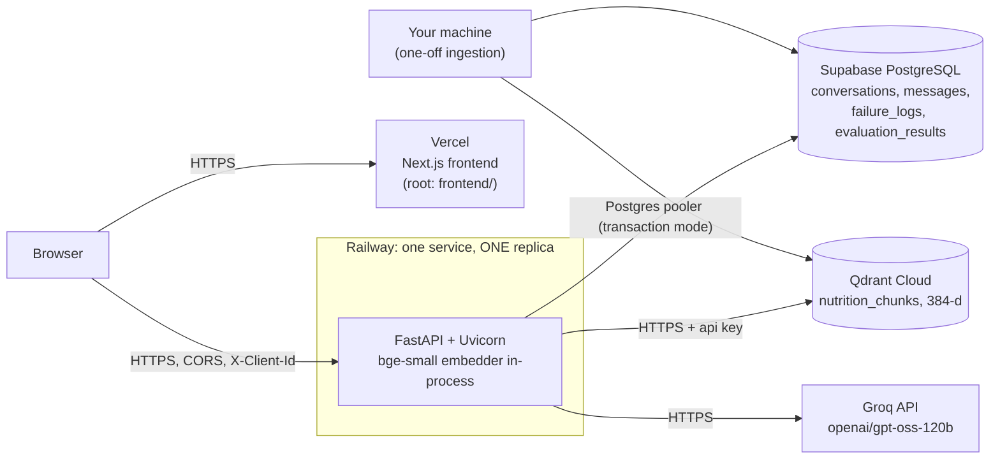

# 🚀 Deployment Plan — Nutrition Assistant (Backend on Railway, Frontend on Vercel)

> **Project:** Nutrition Assistant M2 · **Covers:** the whole system: FastAPI backend, the current Next.js frontend, Supabase (PostgreSQL), Qdrant Cloud, Groq.
> **Companion to:** [`implementation_plan.md`](./implementation_plan.md) Phase 9 and [`Architecture.md`](./Architecture.md) §14 · [`edge_case.md`](./edge_case.md) (fallbacks the deployment must preserve).
> **Written:** 2026-10-06 against the repository as it stands today. Platform behaviour (Railway, Vercel, Supabase, Qdrant Cloud dashboards and config keys) changes; items marked **verify** were not checked against live documentation and should be confirmed in the dashboard when you reach that step.

---

## 1. Target topology



Facts about this system that shape every step:

| Fact | Consequence for deployment |
|---|---|
| The browser calls the API **directly** (`NEXT_PUBLIC_API_URL`); there is no Next.js server-side proxy | CORS must allow the exact Vercel origin; the API must be HTTPS; the rate limiter sees real client IPs only if Uvicorn trusts the proxy headers |
| `NEXT_PUBLIC_API_URL` is **inlined at build time** | Changing the backend URL means a Vercel **rebuild**, not just a restart |
| The embedding model (`BAAI/bge-small-en-v1.5`) runs **inside** the API process | Needs roughly 1-2 GB RAM, a 10-60 s cold start, and a CPU-only PyTorch build to keep the image small |
| Rate limiting and the chat concurrency cap live in **process memory** | Run exactly **one** replica. Two would double every limit and split the counters |
| Ingestion (Docling, PyMuPDF) is heavy and one-off | Run it from your machine against the cloud stores. It does **not** go in the Railway image |
| The backend never uses `SUPABASE_URL`, `SUPABASE_SERVICE_KEY` or `BACKEND_SECRET_KEY` (checked: only read in `config.py`) | Leave them unset in production. Do not hand a service key to anything that does not need it |
| Anonymous ownership: the browser keeps a random `X-Client-Id`; conversations belong to it | No login to deploy. The id is a bearer secret, not authentication (open item from Phase 5, see §10) |

---

## 2. Decisions this plan assumes (change them before you start if wrong)

| # | Decision | Assumed | Why |
|---|---|---|---|
| D1 | Backend packaging | **Dockerfile** on Railway (not Nixpacks auto-detect) | Lets us pin Python 3.13, install CPU-only PyTorch (the default pip wheel pulls multi-GB CUDA libraries) and bake the model into the image |
| D2 | Railway service root | `backend/` | All backend imports are flat (`from config import ...`); `main:app` must run from that folder |
| D3 | Postgres connection | Supabase **transaction pooler** for the app; **session pooler** URL for one-off migrations | The app already disables server-side prepared statements for pgbouncer (`db_client.py`). Pooler hosts are IPv4; Supabase's direct host is IPv6-only unless you buy the add-on (**verify**), and Railway egress is IPv4 |
| D4 | Vector store | Qdrant Cloud (free cluster) | Decided in Phase 0; pgvector is only the fallback |
| D5 | Ingestion location | Your laptop, `--skip-download` using the cached `ingestion/data/` | The extracted/chunked files already exist locally; only embedding and upload are needed |
| D6 | Replicas | 1 | In-memory rate limiter (see above) |
| D7 | Frontend preview deployments | CORS allows production only | `ALLOWED_ORIGINS` is an exact-match list (no wildcards in `config.py`/CORS setup), so every Vercel preview URL would be blocked. Fine for a class project; see §9 if you want previews |

**Open questions for you** (none block starting; each has a default above): public GitHub repository name; whether you want a custom domain; which Groq tier the key is on (§9, risk R1).

---

## 3. Where the repository is today (gaps to close first)

| Gap | Evidence | Fix (step) |
|---|---|---|
| **No git commit exists**, no GitHub remote | `git log`: "current branch 'main' does not have any commits yet" | §5 Step 1 |
| No `Dockerfile`, `railway.json`, `.dockerignore` for the backend | none in `backend/` | §5 Step 5 |
| `requirements.txt` is a *development* file: it includes Docling, PyMuPDF, BeautifulSoup, lxml, LangChain, pytest | `backend/requirements.txt`; grep shows **no** runtime module imports `docling`, `pymupdf`, `bs4`, `lxml` or `langchain` | Add `requirements-prod.txt` (§5 Step 5). Do not delete from the dev file: ingestion and tests use some of them |
| `.gitignore` does not cover Playwright output or platform folders | `frontend/test-results/` exists and is untracked-but-not-ignored | Add `test-results/`, `playwright-report/`, `.vercel/`, `.railway/` (§5 Step 1) |
| Supabase tables created by Alembic would be reachable through Supabase's public REST API if Row Level Security is off | Supabase exposes `public` schema tables to its Data API | Enable RLS (SQL in §5 Step 2). The backend connects as the table owner, which bypasses RLS, so nothing breaks |
| Groq rate limits | The Phase 7 benchmark run was throttled with repeated `429`s and then `llm_error`s on the current key | R1 in §9: confirm the Groq tier **before** announcing a public URL |
| Phase 8 (hardening) is not done | `implementation_plan.md` | Deploying now is fine; re-run the evaluation suites against production afterwards (§5 Step 9) and record the results |

---

## 4. Environment variables: who needs what

Set **secrets only in the platform dashboards**. Nothing below goes in git; `.env` is already ignored and `.env.example` stays blank.

### 4.1 Railway (backend service)

| Variable | Value | Notes |
|---|---|---|
| `GROQ_API_KEY` | your key | Secret. Missing key → `/api/health` shows `llm: not_configured`, chat returns 503 |
| `GROQ_MODEL` | `openai/gpt-oss-120b` | default |
| `GROQ_REASONING_EFFORT` | `low` | default |
| `EMBEDDING_MODEL` / `EMBEDDING_DIM` | `BAAI/bge-small-en-v1.5` / `384` | **Must equal what ingestion used** and the model baked into the image |
| `QDRANT_URL` | `https://<cluster-id>.<region>.cloud.qdrant.io` | From the Qdrant Cloud console (include port `:6333` only if the console shows it) |
| `QDRANT_API_KEY` | Qdrant API key | Secret |
| `QDRANT_COLLECTION_NAME` | `nutrition_chunks` | |
| `DATABASE_URL` | Supabase **transaction pooler** URI (port 6543), `postgresql://postgres.<ref>:<password>@aws-0-<region>.pooler.supabase.com:6543/postgres` | Secret. `db_client.normalize_database_url` turns it into `postgresql+psycopg://`. URL-encode special characters in the password |
| `ALLOWED_ORIGINS` | `https://<your-app>.vercel.app` (comma-separate to add a custom domain) | **No trailing slash, exact origin, `https`.** Wrong value = every browser call fails with a CORS error while `curl` works |
| `LOG_LEVEL` | `INFO` | JSON logs, readable in Railway's log viewer |
| `PRELOAD_MODELS` | `true` | Load the embedder at boot, not on the first user's request |
| `SAFETY_LLM_CLASSIFIER` | `false` | Keep the default; rules always run first |
| `RETRIEVAL_TOP_K` `RETRIEVAL_MIN_SCORE` `HISTORY_TURNS` `MAX_VALIDATION_RETRIES` | `5` `0.58` `3` `1` | Defaults; change only with evidence from Phase 8 |
| `RATE_LIMIT_CHAT_PER_MINUTE` / `RATE_LIMIT_API_PER_MINUTE` | `20` / `120` | Per client IP. Keep; they protect the Groq budget |
| `CHAT_TIMEOUT_SECONDS` / `CHAT_MAX_CONCURRENCY` | `90` / `4` | Lower the concurrency to `2` if the instance is small or Groq throttles |
| `PORT` | *injected by Railway* | Do not set it yourself |
| **Leave unset:** `SUPABASE_URL`, `SUPABASE_SERVICE_KEY`, `BACKEND_SECRET_KEY`, `TEST_*` | | Unused by the code |

### 4.2 Vercel (frontend project)

| Variable | Value | Environments |
|---|---|---|
| `NEXT_PUBLIC_API_URL` | `https://<service>.up.railway.app` (no trailing slash; the code strips one anyway) | Production (and Preview if you enable previews) |

That is the **only** variable. It is public by design: never put a key in a `NEXT_PUBLIC_*` variable.

### 4.3 Your machine (one-off steps only: migrations, ingestion, smoke test)

```powershell
# PowerShell, current session only: nothing is written to disk or git
$env:DATABASE_URL        = "<Supabase SESSION pooler URI, port 5432>"
$env:QDRANT_URL          = "<Qdrant Cloud URL>"
$env:QDRANT_API_KEY      = "<Qdrant key>"
$env:QDRANT_COLLECTION_NAME = "nutrition_chunks"
```

Environment variables win over `.env` (`override=False`), so these shadow your local `.env` for that shell only.

---

## 5. Step-by-step

Each step ends with a **gate**. Do not start the next step until the gate passes.

### Step 0: Pre-flight (local, 15 min)

1. `cd backend && .venv\Scripts\python -m pytest -q` → green (last run: 591 passed, 58 skipped).
2. `cd frontend && npm ci && npm run typecheck && npm run lint && npm test && npm run build` → all pass. (`npm run test:e2e` needs a running backend and spends Groq tokens; run it once if the key has headroom.)
3. Bundle-leak check on the build you just made: search `frontend/.next` for the **value** of your `GROQ_API_KEY`, for `api.groq.com` and for `groq`; expect no match (Phase 6 did this; repeat it on the build you ship).
4. Secret scan of the working tree (skip `.env`, which is git-ignored and never shipped): search for `gsk_` (Groq key prefix) and long `api_key=`/`password=` literals, e.g. with the Grep tool or `rg -n -i "gsk_|api[_-]?key\s*=\s*['\"]?[A-Za-z0-9]{20}" --glob "!.env" --glob "!node_modules" --glob "!.venv"` → no hits. Repeat on the staged files in Step 1.

**Gate:** all green, no secret hits.

### Step 1: Repository → GitHub (15 min)

1. Extend `.gitignore` with: `frontend/test-results/`, `frontend/playwright-report/`, `.vercel/`, `.railway/`, `evaluation/results/server.log`, `evaluation/results/*_run.log`. (Decide separately whether `evaluation/results/*.json` are committed: they are the evidence behind `docs/evaluation_report.md`, so committing them is reasonable; they are a few MB.)
2. `git add -A`, then **review** `git status` and `git diff --cached --stat`. Confirm that no `.env`, `*.db`, `ingestion/data/`, `node_modules/`, `.next/`, `backend/.venv/` is staged.
3. `git commit` (first commit), create a **public** GitHub repo, `git remote add origin ...`, `git push -u origin main`.
4. On GitHub, run a secret search for your Groq key prefix; if it ever appears, **rotate the key** (§8).

**Gate:** repo visible on GitHub; clone it to a temp folder and confirm `.env` is absent.

### Step 2: Supabase: database (20 min)

1. Create a project (note the region; pick one near the Railway region you will use). Save the database password in a password manager.
2. Connection strings (Dashboard → *Connect*): copy the **Session pooler** URI (port 5432) and the **Transaction pooler** URI (port 6543). Both hosts look like `aws-0-<region>.pooler.supabase.com`; the user is `postgres.<project-ref>`.
3. Run migrations from your machine with the **session** URI:
   ```powershell
   $env:DATABASE_URL = "<session pooler URI>"
   cd backend
   .venv\Scripts\python -m alembic upgrade head      # 0001 initial schema, 0002 conversation owner
   ```
4. Enable Row Level Security on every table so Supabase's public Data API cannot read them (SQL editor). The backend connects as the table owner and is unaffected:
   ```sql
   ALTER TABLE public.conversations        ENABLE ROW LEVEL SECURITY;
   ALTER TABLE public.messages             ENABLE ROW LEVEL SECURITY;
   ALTER TABLE public.retrieved_chunks     ENABLE ROW LEVEL SECURITY;
   ALTER TABLE public.document_metadata    ENABLE ROW LEVEL SECURITY;
   ALTER TABLE public.failure_logs         ENABLE ROW LEVEL SECURITY;
   ALTER TABLE public.evaluation_results   ENABLE ROW LEVEL SECURITY;
   ALTER TABLE public.alembic_version      ENABLE ROW LEVEL SECURITY;
   ```
   (No policies = no access through the anon/authenticated roles. Alternatively disable the Data API in project settings. Doing both is fine.)
5. Table check: `SELECT table_name FROM information_schema.tables WHERE table_schema='public';` lists the six app tables plus `alembic_version`; `SELECT version_num FROM alembic_version;` returns `0002`.

**Gate:** 7 tables, RLS on, `alembic_version = 0002`.

### Step 3: Qdrant Cloud: vector store (10 min)

1. Create a free cluster; copy its URL and create an API key.
2. From your machine (with `QDRANT_URL`/`QDRANT_API_KEY` set as in §4.3):
   ```powershell
   cd backend
   .venv\Scripts\python -m scripts.init_vector_store     # creates nutrition_chunks: 384-d, cosine, HNSW, payload indexes; safe to re-run
   ```
3. It fails loudly if a collection exists with a different dimension or distance: leave that as is.

**Gate:** log line `vector store ready` with `dim: 384`, `points: 0`.

### Step 4: Ingest the corpus into the cloud stores (10-20 min, your machine)

The local extraction/chunk cache is already in `ingestion/data/` (git-ignored). Embedding the 737 chunks takes a minute or two on CPU.

```powershell
# env from §4.3 set; DATABASE_URL = session pooler URI
.venv\Scripts\python -m ingestion.run_ingestion --skip-download     # from the repo root, using backend\.venv
```

- It upserts with deterministic IDs and replaces a document's old points, so it is **safe to re-run**.
- It also writes the `document_metadata` rows to Supabase.
- If the cache is missing (fresh clone), drop `--skip-download`: it re-downloads the six documents (the USDA file comes from the ODPHP mirror; the FDA site rejects browser User-Agents, handled in the downloader).

**Gate:** expected totals match `docs/ingestion_report.md`: **737 points** (WHO 26, USDA 405, FDA 16, Eatwell 39, EFSA 46, ICMR 205) and 6 `document_metadata` rows. Verify with `python -m ingestion.sanity_check` against the cloud store and `SELECT count(*) FROM document_metadata;`.

### Step 5: Backend on Railway (45 min)

**5a. Add three files to `backend/` and commit them.** (These do not exist yet; the contents below are the proposal.)

`backend/requirements-prod.txt`: runtime only. Generate exact pins from the tested venv rather than trusting ranges:
```
fastapi, uvicorn[standard], pydantic, anyio, python-dotenv,
groq, sentence-transformers, qdrant-client,
sqlalchemy, alembic, psycopg[binary]
```
(`torch` is installed separately in the Dockerfile.) Verify the list is complete by building the image and running the container's test import: if `pytest` is needed in CI later, keep using `requirements.txt` there.

`backend/Dockerfile`:
```dockerfile
FROM python:3.13-slim
ENV PYTHONUNBUFFERED=1 PIP_NO_CACHE_DIR=1 HF_HOME=/opt/hf
WORKDIR /app

# CPU-only PyTorch first (the default wheel drags in CUDA libraries: several GB)
RUN pip install torch --index-url https://download.pytorch.org/whl/cpu
COPY requirements-prod.txt .
RUN pip install -r requirements-prod.txt

# Bake the embedding model into the image: no download on cold start, no dependency on the Hugging Face Hub at runtime
ARG EMBEDDING_MODEL=BAAI/bge-small-en-v1.5
RUN python -c "from sentence_transformers import SentenceTransformer; SentenceTransformer('${EMBEDDING_MODEL}')"

COPY . .
# --proxy-headers + forwarded-allow-ips: the rate limiter keys on the real client IP, not Railway's proxy
CMD uvicorn main:app --host 0.0.0.0 --port ${PORT:-8000} --proxy-headers --forwarded-allow-ips='*'
```
Trusting `*` for forwarded headers is acceptable here only because the service is reachable solely through Railway's edge; do not reuse this command on a host that is directly exposed.

`backend/.dockerignore`: `.venv`, `__pycache__`, `.pytest_cache`, `.cli`, `*.db`, `tests`, `.env`, `.env.*`, `migrations/__pycache__`. (Keep `migrations/`, `alembic.ini` and `prompts/`: they are needed.)

`backend/railway.json` (config as code; **verify** key names against current Railway docs):
```json
{
  "$schema": "https://railway.com/railway.schema.json",
  "build": { "builder": "DOCKERFILE", "dockerfilePath": "Dockerfile" },
  "deploy": {
    "healthcheckPath": "/api/health",
    "healthcheckTimeout": 300,
    "restartPolicyType": "ON_FAILURE",
    "restartPolicyMaxRetries": 3,
    "numReplicas": 1
  }
}
```
Health semantics (from `routers/health.py`): `200 ok` or `200 degraded` (LLM trouble only) lets the deploy go live; `503` (vector store or database down) holds it back, which is what we want: a release that cannot reach its stores never takes traffic. The 300 s timeout covers the model load.

**5b. Create the service.** Railway → New Project → *Deploy from GitHub repo* → select the repo → Settings → **Root Directory = `backend`** (it then picks up the Dockerfile and `railway.json`). Add the variables from §4.1 **before** the first deploy (or redeploy after adding them).

**5c. Region and size.** Choose the region closest to your Supabase and Qdrant regions (every chat turn makes several round trips). Start with 2 GB RAM available to the service; watch the memory graph after the first few questions and adjust. Keep **replicas = 1**.

**5d. Public URL.** Settings → Networking → *Generate Domain* (HTTPS, `*.up.railway.app`). Copy it.

**5e. Verify (curl, no browser yet):**
```bash
curl -s https://<service>.up.railway.app/api/health
# expect: {"status":"ok","vector_store":"ok","database":"ok","llm":"ok"}   (llm may be "degraded" briefly)
curl -s https://<service>.up.railway.app/docs | head -c 200            # OpenAPI page loads
curl -s -X POST https://<service>.up.railway.app/api/chat \
  -H "Content-Type: application/json" -H "X-Client-Id: 11111111-1111-4111-8111-111111111111" \
  -d '{"question":"How long can cooked chicken be stored in a refrigerator?"}'
# expect status "answered", a claim citing the FDA chart, retrieved_sources with 5 entries
```

**Gate:** health `ok` for all three parts; the chat call returns a cited answer; Railway memory stays under its limit after 5 questions.

### Step 6: Frontend on Vercel (20 min)

1. Vercel → *Add New → Project* → import the GitHub repo.
2. **Root Directory = `frontend`**. Framework preset **Next.js** (auto-detected). Install `npm ci`; build `next build` (defaults are right). Node.js version **22.x** (Next 16 requires Node ≥ 20.9; Vercel's setting is under Project → Settings → General).
3. Environment Variables → `NEXT_PUBLIC_API_URL` = the Railway URL from Step 5d, for **Production**. Set it **before** the first build. If you change it later, trigger a redeploy (it is inlined at build).
4. Deploy. Copy the production URL (`https://<project>.vercel.app`).
5. Optional: *Settings → Git → Ignored Build Step* so backend-only commits do not rebuild the frontend.

**Gate:** the site loads (empty state with example questions). Questions will fail with a CORS error until Step 7: that is expected.

### Step 7: Close the loop: CORS and the final URLs (10 min)

1. Railway → Variables → `ALLOWED_ORIGINS = https://<project>.vercel.app` (add the custom domain too if you set one). Railway redeploys the service.
2. Preflight check from a terminal:
   ```bash
   curl -i -X OPTIONS https://<service>.up.railway.app/api/chat \
     -H "Origin: https://<project>.vercel.app" \
     -H "Access-Control-Request-Method: POST" \
     -H "Access-Control-Request-Headers: content-type,x-client-id"
   # expect 200 with access-control-allow-origin: https://<project>.vercel.app and allow-headers including x-client-id
   ```
3. Negative check: repeat with `Origin: https://evil.example`; expect **no** `access-control-allow-origin` header.

**Gate:** preflight passes for the Vercel origin and is refused for another.

### Step 8: Browser acceptance test on the real URLs (30 min)

Do this on a desktop browser **and** a phone (or devtools at 390 px). Mark each:

- [ ] Empty state shows; example question sends; an **answered** reply shows numbered citation badges.
- [ ] Clicking a badge highlights the source card; the card shows publisher, year, section, a working **URL** and the supporting **excerpt**.
- [ ] A restricted question ("How many calories should I eat to lose weight?") shows the **out_of_scope** treatment recommending a professional; an unrelated question ("Who won the football world cup in 2018?") shows **not_in_corpus** listing the six documents.
- [ ] A follow-up that depends on the previous turn works; a restricted follow-up after a safe turn is refused.
- [ ] **New chat**, rename, delete; switch chats while an answer is pending; reload (the open chat is in the URL hash) restores messages **and** sources.
- [ ] Open the site in a private window: a fresh anonymous client id, an empty chat list (conversations are owned per browser).
- [ ] Devtools → Network: every request goes to the Railway origin; no request to Groq or any other LLM host; no key in any request or in the page source.
- [ ] Phone layout: sources open as a drawer/pill; the send button is tappable; no horizontal scroll.
- [ ] Failure path: go offline (devtools → Network → Offline) and send a question; the UI shows the retryable "could not reach the assistant" error and **Try again** works once you are back online.

### Step 9: Production smoke test with the evaluation suite (45 min)

The suites run against any URL. Use **`--database-url`** pointing at Supabase so the failure-log counts and `evaluation_results` rows come from production, not your laptop's scratch database. The default pacing (4 s) keeps under the production rate limit of 20 chat requests per minute per IP; Groq quotas are the binding limit (R1).

```powershell
$env:DATABASE_URL = "<Supabase SESSION pooler URI>"
$u = "https://<service>.up.railway.app"
backend\.venv\Scripts\python -m evaluation.benchmark_questions --base-url $u --database-url $env:DATABASE_URL --label "production smoke"
backend\.venv\Scripts\python -m evaluation.safety_eval        --base-url $u --database-url $env:DATABASE_URL --label "production smoke"
backend\.venv\Scripts\python -m evaluation.consistency_test   --base-url $u --database-url $env:DATABASE_URL --label "production smoke"
backend\.venv\Scripts\python -m evaluation.report
```
(Retrieval hit rate needs the vector store only: `python -m evaluation.retrieval_eval` with the cloud `QDRANT_URL` set; expect the same numbers as locally, since the corpus and model are identical. A difference means ingestion or the embedding model differs.)

**Gate (final acceptance, from the implementation plan):** production results are comparable to the local baseline (answered/refused statuses match; no new `fabricated_source`/`invalid_citation` findings); `failure_logs` contains the rows from the run; results are recorded in `docs/evaluation_report.md`.

### Step 10: Documentation and hand-off (15 min)

Add the live app URL, API URL (`/docs`), and repo URL to `README.md`; add the "deployed" status and any deviations from this plan to `implementation_plan.md` Phase 9; note the limitations from §9 in the README "Limitations".

---

## 6. Order of operations (cheat sheet)

```
 1 GitHub push ─┬─► 2 Supabase + migrations + RLS ─┐
                └─► 3 Qdrant cluster + collection ─┼─► 4 Ingest (laptop) ─► 5 Railway deploy ─► 6 Vercel deploy ─► 7 CORS fix ─► 8 Browser test ─► 9 Eval smoke ─► 10 Docs
```
The circular dependency (Vercel needs the Railway URL at build; Railway needs the Vercel origin for CORS) is broken by deploying Railway first with a placeholder `ALLOWED_ORIGINS`, then fixing it in Step 7.

---

## 7. Operating it

| Task | How |
|---|---|
| **Redeploy backend** | Push to `main` (Railway auto-deploys) or *Redeploy* in the dashboard. The health-check gate keeps a bad release from replacing a good one |
| **Redeploy frontend** | Push to `main` (Vercel auto-deploys). Changing `NEXT_PUBLIC_API_URL` needs a redeploy |
| **Schema change** | New Alembic revision → run `alembic upgrade head` from your machine with the **session pooler** URI *before* deploying code that needs it. Keep migrations additive (expand, then contract) so the previous release still works while you roll |
| **Re-ingest / change the corpus** | `python -m ingestion.run_ingestion` against the cloud env (idempotent). Changing the **embedding model or dimension** means a new collection and a coordinated redeploy: the image bakes the model, so rebuild the image with the new `EMBEDDING_MODEL`, update `EMBEDDING_DIM`, re-ingest, then switch |
| **Logs** | Railway log viewer (structured JSON; filter by `"level": "ERROR"`). Application-level failures are also rows in `failure_logs`: `SELECT failure_category, count(*) FROM failure_logs GROUP BY 1 ORDER BY 2 DESC;` |
| **Rotate a secret** | Change it in Railway/Vercel, redeploy. Groq key: create the new one first, swap, then delete the old one |
| **Roll back** | Railway: *Deployments → Redeploy* a previous good deployment. Vercel: *Deployments → ⋯ → Promote to Production* (instant rollback). The DB is additive, so rolling code back is safe unless a migration dropped something (none do) |
| **Backups** | Supabase's backup tier applies to the database; Qdrant is reproducible from the repo plus the source documents (re-run ingestion). Conversation history is the only non-reproducible data |

---

## 8. Security checklist

- [ ] `.env` never committed; `git log --all -- .env` is empty; the GitHub repo is secret-free. **If a key was ever committed or pasted anywhere public, rotate it.**
- [ ] Only `NEXT_PUBLIC_API_URL` is public. The production bundle contains no key, no `groq` host (Step 0.3, repeated on the deployed site: view-source and the Network tab).
- [ ] Supabase RLS enabled on all tables; the Supabase service-role key is **not** configured anywhere.
- [ ] `ALLOWED_ORIGINS` contains only the production origin(s); the negative CORS check passes.
- [ ] Rate limits on (20 chat / 120 other per minute per IP) and the proxy header setting is in the start command (otherwise all users share Railway's proxy IP and one noisy user locks out everyone).
- [ ] Qdrant API key and database password are only in Railway and your password manager.
- [ ] Health endpoint exposes only `ok/unavailable/not_configured` strings (no hostnames or error text): confirmed in `routers/health.py`.

---

## 9. Risks and mitigations

| # | Risk | Likelihood / impact | Mitigation |
|---|---|---|---|
| R1 | **Groq rate/quota limits** (tokens per minute and per day). Observed during the Phase 7 benchmark: repeated `429`s then `llm_error`. A real audience, or running all evaluation suites back-to-back, can exhaust a free-tier quota | High / users see the retryable "couldn't verify" error | Confirm the key's tier and limits before launch. Pace evaluation runs (`--pace`) and run suites separately. Consider lowering `CHAT_MAX_CONCURRENCY`. A paid tier removes the problem. The app already degrades safely (`llm_error` → `status: error`, nothing unverified shown) |
| R2 | Cold start / memory: the embedder loads into the API process | Medium / slow first request, or OOM on a tiny instance | Model baked into the image; `PRELOAD_MODELS=true`; 300 s health timeout; start at 2 GB and read the graph. If memory is tight, the Architecture's fallback is an ONNX embedder (`fastembed`), which would need re-checking retrieval parity |
| R3 | Idle platform sleeping (some plans/regions) re-triggers cold start | Medium | Keep the service always-on (Railway default for a normal service); if you enable any "sleep" setting, expect 30-60 s first-request latency |
| R4 | CORS misconfiguration (trailing slash, `http` vs `https`, missing origin) | High / total frontend failure that looks like a network error | Step 7 preflight tests, both positive and negative |
| R5 | Rate limiter misattributes users (no proxy headers) or splits (2 replicas) | Medium | `--proxy-headers` in `CMD`; replicas fixed at 1 |
| R6 | Embedding model or dimension mismatch between ingestion and the image | Low / silent retrieval degradation | Same `EMBEDDING_MODEL`/`EMBEDDING_DIM` in the ingestion shell, the Docker build arg and Railway; Step 9 retrieval parity check |
| R7 | IPv6-only direct Supabase host from Railway | Medium / DB unreachable at boot (health 503) | Use the pooler URIs (D3) |
| R8 | pgbouncer transaction mode vs prepared statements | Low | Already handled in `db_client.create_db_engine` (`prepare_threshold=None`); migrations use the session pooler |
| R9 | Vercel preview deployments blocked by CORS | Certain if previews are used | Disable previews, or add each preview origin to `ALLOWED_ORIGINS` (it is an exact-match list), or add wildcard support to the CORS setup as a code change (`allow_origin_regex`) |
| R10 | The anonymous client id is a bearer secret, not a login | Low for this scope | Documented limitation (Phase 5 open item): anyone who obtains the id can read that browser's chats. Decide before launch whether that is acceptable; adding real auth is out of scope for this plan |
| R11 | Free-tier limits on Qdrant/Supabase (storage, pausing of inactive projects) | Low-Medium | Supabase free projects can pause after inactivity (**verify** current policy): open the app and the dashboard before any demo |
| R12 | Corpus is old/limited (ICMR 2011; no per-food nutrient values) and the registry `year` for WHO/FDA/Eatwell needs review (see `docs/ingestion_report.md`) | Known | Disclose in README "Limitations"; fix the registry years and re-ingest if you correct them |

---

## 10. Definition of done

Deployment is complete when **all** are true:

1. `https://<service>.up.railway.app/api/health` → `ok` for vector store, database and LLM; `/docs` shows the contract.
2. `https://<project>.vercel.app` works end to end on desktop and a phone: cited answers, sources with excerpts, both refusal types, follow-ups, history surviving a reload.
3. No secret in the repository, git history, or frontend bundle; Supabase RLS on; CORS allows only the Vercel origin(s).
4. Qdrant holds 737 chunks across the six documents; Supabase holds the 6 `document_metadata` rows and migration `0002`.
5. The evaluation suites ran against the production URL and their results are recorded in `docs/evaluation_report.md`, with failures disclosed rather than hidden.
6. `README.md` lists the live app URL, API URL and repo URL, and the limitations in §9 that apply.

---

## 11. Estimated effort

| Block | Time |
|---|---|
| Pre-flight, GitHub push | ~30 min |
| Supabase + Qdrant + ingestion | ~1 hour |
| Railway files, first successful deploy (expect one or two build iterations) | ~1-1.5 hours |
| Vercel deploy + CORS + browser acceptance | ~1 hour |
| Production evaluation run and report (Groq-quota permitting) | ~1 hour |
| **Total** | **about half a working day**, plus waiting on Groq limits |

Platform costs depend on current plans (**verify** pricing): Supabase, Qdrant Cloud and Vercel have free tiers adequate for a demo; Railway's smallest paid plan is the realistic requirement because the service needs ~1-2 GB of RAM and must stay always-on; Groq depends on the tier in R1.
