# 🛠️ AI-Powered Nutrition Assistant — Phase-wise Implementation Plan

> **Project:** Nutrition Assistant M2
> **Sources:** [`Architecture.md`](./Architecture.md) · [`problemStatement.md`](./problemStatement.md)
> **Edge cases:** the corner scenarios and fallback mechanisms for every phase, with status and tests, are in [`edge_case.md`](./edge_case.md).
> **Approach:** Incremental build. Each phase ends with a verifiable exit gate before the next begins. No mocks where real functionality is required; no hardcoded answers to evaluation questions.

---

## Overview

| Phase | Name | Outcome | Depends on |
|---|---|---|---|
| 0 | Foundations & Setup | Repo, tooling, secrets, accounts, skeletons | — |
| 1 | Data Layer | Relational schema + vector collection live | 0 |
| 2 | Corpus Ingestion | 6 documents chunked, embedded, indexed with metadata | 1 |
| 3 | Backend Core Services | Schemas, safety validator, embedder, vector store, LLM client | 1 |
| 4 | RAG Pipeline & Validation | End-to-end grounded, cited, validated answers; failure logging | 2, 3 |
| 5 | API & Conversation Persistence | All endpoints, history, follow-ups | 4 |
| 6 | Frontend | Chat UI, sources panel, citations, refusals, responsive | 5 (can start against API contract after 3) |
| 7 | Evaluation | Retrieval hit rate, benchmarks, consistency, citation spot-check | 4–6 |
| 8 | Hardening & Failure Analysis | Evidence-based fixes, failure report | 7 |
| 9 | Deployment & Documentation | Public app, README, final acceptance | 8 |

```mermaid
gantt
    dateFormat  X
    axisFormat  %s
    section Build
    P0 Foundations        :p0, 0, 1
    P1 Data Layer         :p1, after p0, 1
    P2 Ingestion          :p2, after p1, 2
    P3 Backend Core       :p3, after p1, 2
    P4 RAG Pipeline       :p4, after p2, 2
    P5 API + Persistence  :p5, after p4, 1
    P6 Frontend           :p6, after p3, 3
    section Verify & Ship
    P7 Evaluation         :p7, after p5, 2
    P8 Hardening          :p8, after p7, 1
    P9 Deploy + Docs      :p9, after p8, 1
```

> Phases 2 and 3 are independent and can run in parallel. Phase 6 can start once the API contract is frozen (end of Phase 3) using a contract-conformant stub, then be wired to the real API in Phase 5.

---

## Phase 0 — Foundations & Setup

**Goal:** A clean, secure, reproducible project skeleton.

### Tasks
- [~] Initialise Git repo and push to a **public GitHub** repository. *(local repo initialised on `main`; GitHub remote + push pending)*
- [x] Create the folder structure from Architecture §15: `frontend/`, `backend/`, `ingestion/`, `evaluation/`, `docs/`.
- [x] Add `.gitignore` (must exclude `.env`, `node_modules`, `__pycache__`, downloaded PDFs if large) and `.env.example` with all variables from Architecture §16, **values blank**.
- [ ] Provision accounts and keys: Groq (`GROQ_API_KEY`), Supabase project, Qdrant Cloud cluster (or enable pgvector), Vercel, Railway.
- [x] Backend scaffold: FastAPI app, `requirements.txt` (fastapi, uvicorn, pydantic, langchain, groq, sentence-transformers, qdrant-client, sqlalchemy, psycopg, pymupdf, docling, python-dotenv, pytest), config loader reading env vars, structured logging setup.
- [x] Frontend scaffold: Next.js + TypeScript, `NEXT_PUBLIC_API_URL` wiring.
- [x] Add `GET /api/health` stub and CORS via `ALLOWED_ORIGINS`.
- [x] Decide and record the open stack choices in the Architecture Decision Log: **Qdrant vs pgvector** (default: Qdrant), LLM provider (**Groq, `openai/gpt-oss-120b`**), and embedding model (**local `BAAI/bge-small-en-v1.5` via sentence-transformers, 384 dims** — Groq has no embeddings endpoint, so the OpenAI embedding model from the architecture is replaced). Update the Architecture Decision Log and `.env.example` accordingly.

### Exit gate
- Backend starts locally and `/api/health` returns 200; frontend renders a blank page and can reach the backend.
- No secret is present in the repo (`git grep -i "sk-"` is clean).

**Deliverables touched:** #24 (GitHub repo), part of #26 (README stub).

---

## Phase 1 — Data Layer

**Goal:** Persistent storage ready for conversations, chunks, logs, and evaluation results.

### Tasks
- [x] Write SQLAlchemy models in `backend/models/db_models.py` for: `conversations`, `messages`, `retrieved_chunks`, `document_metadata`, `failure_logs`, `evaluation_results` (Architecture §9).
- [~] Add migrations (Alembic or SQL scripts) and run them against Supabase. *(Alembic migration `0001` written and verified on a fresh PostgreSQL 16; running it against Supabase is pending credentials: `cd backend && alembic upgrade head`)*
- [x] Implement `backend/integrations/db_client.py` (session management, CRUD helpers: create/list/get conversation, save message with retrieved chunks, save failure log, save evaluation result).
- [~] Create the Qdrant collection `nutrition_chunks`: 384 dims (must match the embedding model), cosine distance, HNSW index, payload indexes on `document_name`, `publisher`, `year` (needed for per-document filtering). *(`python -m scripts.init_vector_store` verified on a local Qdrant server; running it against Qdrant Cloud is pending credentials.)*
- [x] Implement `backend/integrations/vector_store.py`: `upsert(chunks)`, `search(vector, k, document_filter=None)`, `count()`, connectivity check for `/health`.
- [x] Unit tests: round-trip write/read for each table; vector upsert → search returns the inserted point.

### Exit gate
- Migrations apply cleanly on a fresh database; vector store connectivity check passes.
- *Status:* met on local PostgreSQL 16 + Qdrant (92 tests passing, incl. migration up/down/in-sync checks). Re-confirm against Supabase and Qdrant Cloud once provisioned.

**Deliverables touched:** #4 (persistent storage), #12 (vector DB integration, part).

---

## Phase 2 — Corpus Ingestion Pipeline

**Goal:** All 6 official documents are processed into metadata-rich, embedded chunks in the vector store.

### Tasks
- [x] Create `ingestion/document_registry.json` with name, publisher, year, source URL, format for the 6 documents (Architecture §12); `retrieval_date` filled at download time. *(Adds `extractor`, optional `download_url` and `exclude_pages`; `retrieval_date` is written to `ingestion/data/manifest.json`. The `year` values need review: see below.)*
- [x] `download_documents.py` — fetch the 5 PDFs and scrape the WHO HTML page; record `retrieval_date`; fail loudly on HTTP errors (verify every URL resolves — the Eatwell URL in particular). *(All 6 resolve. `fda.gov` rejects browser User-Agents and `dietaryguidelines.gov` blocks scripts outright, so USDA is fetched from the official ODPHP copy via `download_url`; citations keep the original URL.)*
- [x] `extract_text.py` — PyMuPDF for general text; **Docling for table-heavy docs** (FDA storage chart, EFSA DRV tables). Extract section headings per page/section. *(Docling is used for EFSA. For FDA it garbles the font and finds no table, so `fda_chart.py` rebuilds the chart from PyMuPDF word positions; recorded in the Architecture Decision Log.)*
- [x] `chunker.py` — recursive splitting, **512 tokens / 64 overlap**; treat tables, numbered recommendations, and lists as **atomic units** (do not split; allow oversize chunks if needed). Attach heading-derived `section`. *(Atomic when they fit; oversize ones are split on row/item boundaries with the header/lead-in repeated, because the model's input window is 512 tokens.)*
- [x] Generate chunk metadata exactly per Architecture §6: `chunk_id` (stable, deterministic, e.g. `who_healthy_diet_chunk_007`), `document_name`, `publisher`, `year`, `source_url`, `retrieval_date`, `section`, `chunk_index`, `total_chunks`, `text`.
- [x] `embedder.py` — batch-embed locally with `BAAI/bge-small-en-v1.5` (sentence-transformers; normalised vectors; use the model's query instruction prefix for queries only). Count chunk tokens with this model's tokenizer, not tiktoken; the model's 512-token limit matches the chunk size, so verify no atomic table chunk exceeds it (split or truncate deliberately if so). *(Reuses the backend `Embedder`; the 512 budget covers `[CLS]`/`[SEP]` and the embedded section prefix; 0 chunks over the limit.)*
- [x] `upload_to_vectorstore.py` — idempotent upsert (deterministic IDs so re-runs don't duplicate); also write `document_metadata` rows. *(A document's old points are replaced, so stale chunks never linger; re-running gave the same 737 points.)*
- [x] Ingestion report: per-document chunk counts, average chunk size, sections detected, any empty or garbled pages. *(`docs/ingestion_report.md`, regenerated on every run, plus numeric-fidelity and registry-year checks.)*
- [x] **Manual QA of chunks:** inspect a sample from every document, especially tables (FDA, EFSA). Fix extraction problems here — they will otherwise surface as retrieval "failures" later. *(`docs/ingestion_manual_qa.md`.)*
- [~] Run against Qdrant Cloud and Supabase. *(Verified end to end on an embedded local Qdrant and SQLite because no credentials are provisioned yet: `python -m ingestion.run_ingestion` with `QDRANT_URL` / `DATABASE_URL` set does the real run. Pending credentials.)*

### Exit gate
- All 6 documents present in the vector store and `document_metadata`; every chunk has complete metadata; tables verified intact; re-running ingestion is idempotent.
- No nutrient values invented or sourced outside the 6 documents.
- *Status:* met on local Qdrant + SQLite: 6 documents, 737 chunks (WHO 26, USDA 405, FDA 16, Eatwell 39, EFSA 46, ICMR 205), metadata validated per chunk, 0 table numbers absent from their source page, idempotent re-runs, 10/10 smoke retrieval, 44 ingestion tests green. **Open items** (not blockers): the registry `year` for WHO, FDA and Eatwell disagrees with the files retrieved (see the report), and ICMR growth tables have no column titles. Re-confirm against Qdrant Cloud and Supabase once provisioned.

**Deliverables touched:** #8 (corpus), #9 (extraction pipeline), #10 (chunking + metadata), #11 (embeddings), #12 (vector DB).

---

## Phase 3 — Backend Core Services

**Goal:** All building blocks of the request pipeline exist and are individually tested.

### 3.1 Schemas & contracts
- [x] `backend/models/schemas.py`: `ResponseStatus`, `SourceReference`, `Claim`, `NutritionResponse` (Architecture §11) plus API request/response models (`ChatRequest`, `ChatResponse` incl. `retrieved_sources`).
- [x] Pydantic validators: `claims` non-empty when `status=answered`; `refusal_reason` required when `status != answered`; claims must be empty for refusals.
- [~] Document any divergence from the original Milestone 1 schema (required by the problem statement) in the README / `docs/`. *(Written in `docs/schema_changes.md` against the Problem Statement §5 baseline; the Milestone 1 schema itself is not in the repo, so that comparison is an open item for the README in Phase 9.)*
- [x] Generate TypeScript types in `frontend/src/types/api.ts` from this contract; **freeze the contract**. *(Hand-written mirror; `tests/test_schemas.py` fails if field names drift from the Pydantic models.)*

### 3.2 Safety validator (`core/safety_validator.py`) — LLM-independent
- [x] Rule layer: regex + keyword + synonym sets for the four categories — calorie targets, weight targets/BMI/"am I overweight", disease-specific diets (diabetes, Crohn's, cancer, CKD, etc.), personalised prescriptions ("plan for me", "my diet").
- [x] Indirect-intent coverage ("I'm trying to lose weight, what's a good deficit?").
- [~] Optional second pass: LLM intent classifier for rule misses (behind a flag; its failure must **fail closed** for restricted-looking input, never bypass the rules). *(Implemented behind `SAFETY_LLM_CLASSIFIER` and unit-tested with fakes, including fail-closed; not yet exercised against the live LLM.)*
- [x] Applied to **every message**, using the current message — never skipped because of conversation history. Consider also checking the last user turn combined with the follow-up for pronoun-style follow-ups ("and for me?"). *(`SafetyValidator.check(message, previous_user_message)` does both; the pipeline calls it on every `/api/chat` request with the previous user turn read from the database; tested in `test_api_chat.py`.)*
- [x] Returns a ready `out_of_scope` response (polite decline, brief reason, recommend dietitian/healthcare professional) with **no LLM and no retrieval call**.
- [x] Tests: the full adversarial matrix (direct, rephrased, indirect, embedded after 5 cooking messages, follow-up after safe message) **plus** negative tests to confirm legitimate questions ("What does WHO say about saturated fat?") are *not* blocked.

### 3.3 Integrations
- [x] `embedder.py` (query embedding; **same model, config and normalisation as ingestion** — a mismatch silently breaks retrieval). Load the model once at app startup, not per request. *(`integrations/embedder.py`; preloaded in the FastAPI lifespan, `PRELOAD_MODELS`. Verified against the real model: 384-d, normalised, 512-token limit.)*
- [~] `llm_client.py`: Groq wrapper for `openai/gpt-oss-120b` using JSON-schema structured output (strict mode; confirm current Groq support for this model in their docs and fall back to JSON mode + Pydantic validation if unavailable), low temperature (0–0.2), fixed `seed` if supported, timeouts, retries with backoff on 429/5xx (Groq rate limits), and logging of `model_info` (provider + model id) for failure logs. gpt-oss is a reasoning model: set a low/medium reasoning effort, and make sure reasoning text is never returned to the user or parsed as the answer. *(Strict `json_schema` is supported for gpt-oss-120b per Groq's docs; JSON-mode fallback implemented. All behaviour is unit-tested against a fake Groq client; the live smoke test (`RUN_LIVE_LLM_TESTS=1`, needs `GROQ_API_KEY`) has not been run.)*
- [x] `prompts/system_prompt.txt` — identity, response behaviour, knowledge boundaries, safety boundaries (Problem Statement §6). Must also encode: answer only from provided chunks; cite chunk_ids only from the provided set; present conflicting sources **separately**; state which docs were searched on `not_in_corpus`.

### Exit gate
- Unit tests green for schema validators, safety validator (adversarial + negative sets), embedder, and LLM client (JSON schema conformance on a smoke prompt).
- *Status:* unit tests green (full backend suite: 281 passed, 45 skipped for opt-in real-server/live-API tests). The live Groq smoke test (`RUN_LIVE_LLM_TESTS=1`) has since been run and passes. Corner cases for this phase (typos, personal medication and baby feeding, other languages, mixed and injected intent) are in [edge_case.md](./edge_case.md) §5.

**Deliverables touched:** #5 (schema), #6 (system prompt), #7 (safety enforcement), #16 (out_of_scope mechanism, part).

---

## Phase 4 — RAG Pipeline, Validation & Failure Logging

**Goal:** A question goes in; a grounded, validated, cited structured answer (or the correct refusal) comes out.

### 4.1 Retrieval (`core/rag_pipeline.py`)
- [x] Embed question → vector search top-k (default 5, configurable). *(`RETRIEVAL_TOP_K`; a very short follow-up is searched together with the previous user question.)*
- [x] **Document filter support:** detect a named document in the question (e.g. "according to WHO", "FDA chart") and filter by `document_name`/`publisher`; otherwise search all docs. *(`core/corpus.py` holds the aliases; "WHO" matches only in capitals so the pronoun "who" does not. Routing words are removed from the search text, not from the question the model sees: with them, "WHO and Eatwell … on salt" retrieved WHO's resolution boilerplate instead of its salt section.)*
- [x] **Cross-document retrieval:** for multi-source questions, ensure results aren't dominated by one document. *(Comparison cues or two named documents → per-document top-n (2) merged, capped at 8; chunks are grouped by document in the prompt.)*
- [x] **Not-in-corpus detection:** similarity-score threshold plus an LLM-side `not_in_corpus` status. *(Gate default 0.58, measured on the real corpus: unrelated questions ≤0.53, in-corpus ≥0.69; nutrition-adjacent off-corpus questions overlap with in-corpus and need the model's status. To be tuned on held-out evaluation data in Phase 7/8.)*
- [x] Prompt assembly per Architecture §7: fixed system prompt + retrieved chunks + last N turns of history + question. *(History is quoted and marked context-only; a test shows it cannot forge prompt sections, and the safety check still runs on every message.)*

### 4.2 Generation
- [x] Call LLM with structured output; parse into `NutritionResponse`.
- [x] Prompt rules for conflicts: separate claims per source with publisher + year. *(Enforced as well as prompted: a claim naming another corpus document than the one it cites is rejected as `conflicting_guidance_error`. The status contrast in the prompt was sharpened after a live run where the model answered an off-corpus question with `out_of_scope`.)*

### 4.3 Validation (`core/response_validator.py`)
- [x] Pydantic schema validation.
- [x] Citation verification: every `chunk_id` ∈ retrieved set; source metadata overwritten from the **chunk**; URL ∈ whitelist of the 6 corpus URLs. *(Plus citation re-pointing to a sibling chunk that really holds a correct figure, see the README; model-added markers such as `【chunk_id】` are stripped.)*
- [x] Numerical spot-check: numbers in `claim_text` must appear in the cited chunk text; numbers in the summary must appear in a claim.
- [x] Optional claim-support check — flag, don't silently pass. *(Lexical overlap: near-zero blocks, weak is logged as advisory. No entailment model.)*
- [x] Behaviour on failure: one bounded retry with the errors fed back, then `status=error`; every failure recorded. *(`MAX_VALIDATION_RETRIES`.)*

### 4.4 Failure logging (`core/failure_logger.py`)
- [x] Log to `failure_logs` with `user_question`, `model_response`, `failure_category`, `retrieved_chunks`, `timestamp`, `model_info`, `error_description`.
- [x] Detection for: `schema_validation_failure`, `invalid_citation`, `fabricated_source`, `empty_claims`, `missing_refusal`, `not_in_corpus_answered`, `vague_response` (in `response_validator.py` and the pipeline); `inconsistent_numerical_claim` is a category only, written by the Phase 7 consistency tests. *(`missing_refusal` and `not_in_corpus_answered` cannot fire inside the pipeline because safety and the similarity gate come first; they are functions the evaluation harness uses, covered by unit tests.)*
- [x] Categories the Problem Statement lists that Architecture §13 omits: `unsupported_claim`, `missing_citation`, `incorrect_retrieval` (assigned by evaluation), `conflicting_guidance_error`; plus `llm_error` for provider outages.
- [x] Errors are never swallowed silently: every except-path logs; a failed log write is itself logged at ERROR with the full record.

### Exit gate
- CLI/script run of ≥10 varied questions shows: correct citations, correct `not_in_corpus` on an off-corpus question, correct `out_of_scope` on restricted questions, and at least one cross-document question with separate per-source claims.
- A deliberately corrupted LLM output (test fixture) is rejected and logged, never returned as `answered`.
- *Status:* met. `python -m scripts.ask --batch scripts/phase4_questions.json` ran 14 questions through the real pipeline (real embeddings, the local corpus, real Groq `openai/gpt-oss-120b`): **14/14 met their expectations** in the final run ([phase4_exit_gate_run.md](./phase4_exit_gate_run.md)): cited answers for FDA, WHO, Eatwell, EFSA, ICMR and a follow-up; two cross-document answers with separate per-source claims; an unrelated question stopped by the gate; an off-corpus nutrition question answered `not_in_corpus` (4/4 passes after the prompt fix); four restricted questions refused by the safety layer without retrieval or an LLM call. The corrupted-output fixture is in `tests/test_rag_pipeline.py`: output that stays corrupted becomes `error`, never `answered`, and every attempt is logged. Backend suite: 366 passed, 46 skipped (opt-in real-server tests).
- *Findings from the live runs that shaped the code* (the first run was 12/14): a correct EFSA table figure was cited to the wrong sibling chunk (→ citation re-pointing); routing words skewed comparison retrieval (→ routing-free search text); the model returned `out_of_scope` for an off-corpus question (→ prompt contrast + guaranteed referral); citation markers appeared in claim text (→ stripped). In the final run the validator blocked and retried one generation whose summary stated a number no claim supported.
- *Edge cases closed afterwards* ([edge_case.md](./edge_case.md) §6): a typo'd legitimate question (measured 0.551, below the gate) now gets one spelling-repaired retry using the corpus's own vocabulary; text with no letters or in a non-Latin script is stopped before retrieval (an emoji message scored 0.657 and a Hindi calorie request 0.56 against the 0.58 gate); a claim with the right digits and the wrong unit (mg vs mcg) is blocked.
- *Open:* run against Qdrant Cloud and Supabase once provisioned; the gate and lexical thresholds are untuned beyond this sample; model output varies between runs, so Phase 7 consistency testing is the real measure.

**Deliverables touched:** #5, #12, #13, #14, #15, #16, #17.

---

## Phase 5 — API & Conversation Persistence

**Goal:** Secure, documented endpoints wrapping the pipeline with durable history.

### Tasks
- [x] `POST /api/chat` — full 10-step flow from Architecture §5: safety → embed → retrieve → prompt → LLM → validate → log → persist (message + retrieved chunks + structured response) → return. Creates a conversation if `conversation_id` is null; auto-title from first question. *(`core/chat_service.py` + `routers/chat.py`. History is read, the pipeline runs with no transaction open, then both messages, the retrieved chunks and the failure-log rows are stored in one transaction. The failure rows are buffered (`DeferredFailures`) because `failure_logs.message_id` is a foreign key and the assistant message does not exist until the pipeline has finished.)*
- [x] `POST /api/conversations`, `GET /api/conversations`, `GET /api/conversations/{id}` (messages including retrieved chunks, so the sources panel can be restored on reload). *(`retrieved_sources` is restored for `answered` messages only, per the frozen contract.)*
- [x] `GET /api/health` — vector store connectivity + LLM availability. *(Plus the database. 503 only when the vector store or database is down; an LLM problem alone is a 200 `degraded`. The LLM probe lists models, cached for 60 s and spending no tokens: Groq 404s `models.retrieve` for ids containing "/", found by running it live. Verified live against Groq; the vector store and database checks are pending Qdrant Cloud and Supabase.)*
- [x] Persist **refusals** (`out_of_scope`, `not_in_corpus`) as messages too, with status. *(Also `error`.)*
- [x] Input validation (length limits, empty input), rate limiting, consistent error envelope, timeouts; secrets only from env. *(`ErrorEnvelope` on every non-2xx, including 404/405/500, with CORS headers on 500s; NUL characters rejected; 16 KB body cap; per-IP sliding-window limits; a chat wall-clock timeout (504) and a concurrency cap. The rate limiter is in process memory: one instance only.)*
- [x] Follow-up support: load last N turns for the prompt; confirm the safety check still runs on each new message. *(The previous user turn is read from the database and passed to the safety check on every request.)*
- [x] API tests (pytest + httpx): happy path, each status, invalid input, history round-trip, follow-up after a safe message then restricted message → refused. *(`test_api_chat.py`, `test_api_conversations.py`, `test_api_infra.py`, `test_health.py`: real app, real migrated database, real safety validator and failure logging; only Groq and Qdrant are faked.)*

### Exit gate
- OpenAPI docs reflect the contract; all endpoints pass tests; history survives a server restart.
- *Status:* met. Backend suite: 457 passed, 46 skipped (opt-in real-server tests). "Restart" is simulated by dropping the engine and every cache and reopening the same database file; the API tests run on SQLite only (no PostgreSQL available when this phase was built; the data layer's own tests covered PostgreSQL in Phase 1), so re-confirm on Supabase once provisioned. A live run through the HTTP app (real embeddings, real Groq, local corpus) gave cited answers, a follow-up that used history, a refused restricted follow-up, an off-corpus `not_in_corpus`, a cross-document answer with separate claims, and a reload with sources.
- *Edge cases closed afterwards* ([edge_case.md](./edge_case.md) §7): conversations are now owned by an anonymous per-browser `X-Client-Id` (migration `0002`; others' conversations answer 404), and an abandoned turn releases its concurrency slot so a hung provider call cannot block other chats.
- *Open:* the rate limiter needs `--proxy-headers` behind Railway; the client id is a bearer secret, not a login (decide whether that is enough before Phase 9).

**Deliverables touched:** #3 (backend API), #4 (persistent conversations).

---

## Phase 6 — Frontend

**Goal:** Responsive chat UI with citations and a sources panel that exposes real evidence.

### Tasks
- [x] `useChat.ts` hook: state machine from Architecture §4 (Idle → Submitting → Loading → Answered / NotInCorpus / OutOfScope / Error → Idle); calls **only** the backend API. *(`hooks/useChats.ts`, one state machine per chat (`chatPhase()` derives the §4 state; `submitting` is folded into `loading`) inside a manager for many independent chats. Only `lib/api.ts` talks to the network, and only to `NEXT_PUBLIC_API_URL`.)*
- [x] `ChatPage` layout: `ConversationSidebar` + `ChatWindow` + `SourcesPanel`.
- [x] `ChatWindow` / `MessageList` / `UserBubble` / `AssistantBubble` / `MessageInputBar` (disabled while loading, Enter to send). *(Shift+Enter adds a line; typing stays possible while an answer is pending so a draft is not lost, sending is what is blocked.)*
- [x] `AssistantBubble` renders per-claim text with `CitationBadge` superscripts linked to the matching source. *(Pills numbered like the cards in the panel (retrieval rank + 1).)*
- [x] `SourcesPanel` + `SourceCard`: title, publisher, year, section, clickable URL, **supporting excerpt**; selecting a claim/badge highlights its source — evidence inspectable without leaving the conversation.
- [x] `RefusalBanner`: visually distinct treatments for `not_in_corpus` (lists documents searched) and `out_of_scope` (recommend a professional). *(A third treatment for `error`, so a verification failure is never mistaken for an answer or a refusal.)*
- [x] Loading indicators, error states with retry, empty state with example questions. *(A failed send keeps the question with "Try again"; nothing is stored for a failed turn, so a retry cannot duplicate it.)*
- [x] Conversation history: list, open, new chat; restored sources on reload. *(Multiple independent chats ChatGPT-style: per-chat messages, in-flight request, input draft and source selection, so switching chats mid-answer is safe; the open chat is in the URL hash. Added `PATCH`/`DELETE /api/conversations/{id}` for rename and delete.)*
- [x] Responsive layout: sources panel becomes a drawer/tab on mobile; test at ~375px and desktop. *(Implemented from `stitch_design/code.html`: 220|chat|320 on desktop, sources behind a pill on laptop, icon rail + drawers on tablet, one column on phones with safe-area insets. Checked at 1440, 1100, 820 and 390px.)*
- [x] Accessibility basics: keyboard nav, focus states, aria-live for new messages. *(Conversation is a polite live region; every icon button has an accessible name; visible focus rings; reduced-motion respected. Not audited with a screen reader or an automated tool such as axe.)*
- [x] Component tests + a Playwright smoke flow (ask → answer → open source; restricted question → refusal). *(`npm test`: 55 Vitest tests for the state machine and components. `npm run test:e2e`: 28 Playwright tests in real Chrome against the real backend, including multi-chat independence and the four breakpoints.)*

### Exit gate
- Full flow works locally against the real backend on desktop and mobile widths; no API keys or direct LLM calls in the frontend bundle.
- *Status:* met. `python -m scripts.serve_local` (real embeddings, real Groq `openai/gpt-oss-120b`, the local corpus, SQLite) with `npm run dev`: cited answers with highlighted sources and excerpts, an `out_of_scope` refusal, two chats answered concurrently without mixing, rename and delete, reload restoring sources; 8/28 Playwright tests and 32/55 Vitest tests green. The production build contains no key and no LLM host (scanned `.next`, including for the real `GROQ_API_KEY` value); its only network target is the backend URL.
- *Edge cases closed afterwards* ([edge_case.md](./edge_case.md) §8, §11): another tab's changes appear on focus; `not_in_corpus` is exercised live in the browser and `error` through an intercepted response; axe-core finds no serious or critical violation on five states; the client id header, retry on 429/503/504 and a dropped connection are covered end to end (228 Playwright tests, 55 Vitest tests).
- *Open:* no screen-reader audit; no iOS Safari device test (safe-area insets are in the CSS, untested on a notched iPhone); the design file stops before its iOS and "all states" sections, so those were built from the breakpoint list in its navigation. One live Groq call stalled for ~30 minutes during testing (suspected machine sleep or network); the backend gave up at its 90 s limit with a 504, which the UI shows as a retryable error.

**Deliverables touched:** #1, #2.

---

## Phase 7 — Evaluation

**Goal:** Measured, reproducible evidence of retrieval and answer quality. Results are recorded, not massaged.

### 7.1 Retrieval evaluation (≥15 questions)
- [ ] Author `evaluation/questions/retrieval_questions.json`: each with `question`, `expected_document`, `expected_section`. Cover all 6 documents and the topics in Architecture §12 coverage table.
- [ ] `retrieval_eval.py`: run retrieval only (no LLM), compute **hit@k** (expected doc + section in top-k), per-document breakdown, store in `evaluation_results`.
- [ ] Report retrieval failures **separately** from generation failures.

### 7.2 Benchmark (≥10 questions)
- [ ] `benchmark_questions.json` across the four categories: nutrient requirements, food safety/storage, cooking methods, questions without universal answers (include at least one `not_in_corpus` probe, and a couple of restricted prompts to confirm refusals).
- [ ] `benchmark_questions.py`: run through the **real** `/api/chat`; capture response, retrieved chunks, status.
- [ ] Per-response scoring sheet: unsupported claims, changed numbers, fabricated citations, incorrect/missing refusals, incorrect retrieval, unhelpful uncertainty, citation accuracy. Group failures by category with counts.

### 7.3 Consistency testing
- [ ] `consistency_test.py`: same question ×3 (do for several questions incl. one numeric, one cross-document, one restricted). Compare numbers, cited docs/sections, evidence agreement, recommendation stability, refusal consistency.
- [ ] Any changed factual number → logged as `inconsistent_numerical_claim`; **do not** alter answers to look consistent.

### 7.4 Citation spot-check (≥10 answers)
- [ ] `citation_checker.py` helper: prints claim, cited chunk, document URL, page/section for manual verification.
- [ ] Manually open each cited document, locate section, verify the claim *and* numbers are supported (existence ≠ validity). Record incorrect/unsupported citations.

### 7.5 Adversarial safety run
- [ ] Execute the full adversarial matrix end-to-end through the API (not just unit tests), including long-conversation embedding and follow-up scenarios.

### Outputs
- [ ] `docs/evaluation_report.md` with: retrieval hit rate, benchmark failure table, consistency results, citation spot-check results, safety matrix results.

### Exit gate
- All four evaluation activities completed with recorded results; failure log populated from real runs.

**Deliverables touched:** #18, #19, #20, #21, #22.

---

## Phase 8 — Hardening & Failure Analysis

**Goal:** Improve the system from evidence — not by special-casing questions.

### Tasks
- [ ] Triage `failure_logs` and evaluation results into root causes: extraction/chunking, retrieval (k, filter, thresholds), prompt, validation gaps, safety rules.
- [ ] Apply **general** fixes only (e.g. adjust chunk size for tables, tune top-k/threshold, improve prompt rules, add safety synonyms discovered by adversarial runs, add hybrid/keyword retrieval if hit rate is low). No per-question hardcoding.
- [ ] Re-run Phase 7 suites after each change; record before/after hit rate and failure counts.
- [ ] Write `docs/failure_analysis.md`: failures grouped by category with counts, root causes, fixes applied, and **known remaining limitations** (honest — feeds README "Limitations").
- [ ] Confirm that conflicting-guidance and cross-document answers attribute each source separately.

### Exit gate
- Documented improvement trail; remaining failures understood and disclosed; no regressions in safety tests.

**Deliverables touched:** #23.

---

## Phase 9 — Deployment & Documentation

**Goal:** Public, verified deployment and complete documentation.

### Deployment
- [ ] Backend → Railway (Uvicorn; set all env vars there; set `ALLOWED_ORIGINS` to the Vercel URL).
- [ ] Run migrations against production Supabase; run ingestion against production Qdrant.
- [ ] Frontend → Vercel with `NEXT_PUBLIC_API_URL` pointing to Railway.
- [ ] Verify all endpoints in production (health, create/list/get conversations, chat for each status).
- [ ] **Smoke test: run the evaluation question bank against the production URL** and record results.
- [ ] Confirm no secrets in repo/history/frontend bundle; rotate any key that was ever committed.

### Documentation (`README.md`)
- [ ] Overview, architecture diagram, and technology decisions (with rationale).
- [ ] **RAG configuration table:** chunking strategy, chunk size, overlap, embedding model, vector index type, top-k, limitations (required by Problem Statement §3).
- [ ] Structured schema description and **changes from the Milestone 1 schema**.
- [ ] Safety design and refusal types.
- [ ] Setup instructions: local dev, ingestion, env vars (`.env.example`), tests, evaluation scripts, deployment steps.
- [ ] Links to evaluation report and failure analysis; known limitations (e.g. corpus age — ICMR 2011; no per-food nutrient database).
- [ ] Add live app URL and repo URL.

### Exit gate = Final acceptance (below).

**Deliverables touched:** #24, #25, #26.

---

## Final Acceptance Checklist (from Problem Statement §18)

| Criterion | Verified in |
|---|---|
| Chatbot works end-to-end | P5, P6, P9 smoke test |
| All model calls via backend | P6 bundle check, P9 |
| Every response follows structured schema | P4 validator, P7 |
| Every factual claim has a verifiable citation | P4, P7.4 |
| Answers only from retrieved evidence | P4 prompt + validator, P7.2 |
| Unsupported questions → explicit `not_in_corpus` | P4, P7.2 |
| Medical advice / calorie / weight targets declined | P3.2, P7.5 |
| Safety holds for rephrased and indirect questions | P3.2, P7.5 |
| Cross-document answers preserve attribution | P4.1, P7.2 |
| Conflicting recommendations presented separately | P4.2, P8 |
| Sources panel shows actual supporting evidence | P6 |
| Conversation history persists | P5, P6 |
| Failures recorded, not hardcoded away | P4.4, P8 |
| Retrieval evaluation completed | P7.1 |
| Citation spot-check completed | P7.4 |
| Consistency testing completed | P7.3 |
| Publicly accessible deployment | P9 |
| GitHub repo + README complete | P9 |

---

## Deliverable → Phase Traceability

| # | Deliverable | Phase | # | Deliverable | Phase |
|---|---|---|---|---|---|
| 1 | Full-stack chatbot | 5–6 | 14 | Citation-backed claims | 4 |
| 2 | Responsive frontend | 6 | 15 | Cross-document retrieval | 4 |
| 3 | Backend API | 5 | 16 | Two refusal mechanisms | 3–4 |
| 4 | Persistent conversations | 1, 5 | 17 | Failure logging | 4 |
| 5 | Structured schema | 3 | 18 | ≥15 retrieval questions | 7 |
| 6 | System prompt | 3 | 19 | ≥10 benchmark questions | 7 |
| 7 | Backend safety | 3 | 20 | Consistency results | 7 |
| 8 | 5–7 doc corpus | 2 | 21 | Citation verification | 7 |
| 9 | PDF extraction pipeline | 2 | 22 | Retrieval hit-rate report | 7 |
| 10 | Chunking + metadata | 2 | 23 | Failure analysis report | 8 |
| 11 | Embeddings | 2 | 24 | GitHub repo | 0, 9 |
| 12 | Vector DB integration | 1–2 | 25 | Public deployment | 9 |
| 13 | RAG retrieval pipeline | 4 | 26 | README | 9 |

---

## Gaps in Architecture.md to Resolve During Implementation

| Gap | Where handled |
|---|---|
| Cross-document retrieval has no explicit mechanism beyond top-k + optional filter | P4.1 — per-document / diversified retrieval |
| Failure categories in Architecture §13 omit four from the Problem Statement (unsupported claims, missing citations, incorrect retrieval, conflicting guidance) | P4.4 |
| No defined behaviour when validation fails after generation (retry vs. error) | P4.3 — bounded retry, then `error` status |
| `not_in_corpus` detection method unspecified | P4.1 — score threshold tuned on eval data + LLM status |
| Model-provided source metadata could drift from the chunk | P4.3 — overwrite from retrieved chunk metadata |
| No guard against overfitting retrieval/prompt tuning to the evaluation questions | P7/P8 — keep a held-out set of questions not used for tuning |

## Key Risks

| Risk | Mitigation |
|---|---|
| Poor table extraction (FDA/EFSA) → bad retrieval | Docling + manual chunk QA in Phase 2 |
| Source URL changes or is blocked | Verify in Phase 0/2; keep local copies of downloaded files |
| Safety rules over-block legitimate questions | Negative test set in Phase 3.2 |
| LLM numeric drift between runs | Low temperature, numeric spot-check, consistency tests (log, don't mask) |
| Free-tier limits / cold starts in production | Test early in Phase 9; document in README |
| Groq rate limits (tokens/min) during evaluation runs | Backoff + throttling in `llm_client`; pace the benchmark and consistency scripts |
| Local embedding model adds memory and cold-start time on Railway | Load once at startup; consider `fastembed` (ONNX) if memory is tight; check instance size in Phase 9 |
| gpt-oss structured-output or reasoning-effort behaviour differs from `gpt-4o` | Smoke-test schema adherence in Phase 3; Pydantic validation remains the backstop |
| Overfitting to the evaluation set | Held-out questions; general fixes only |
