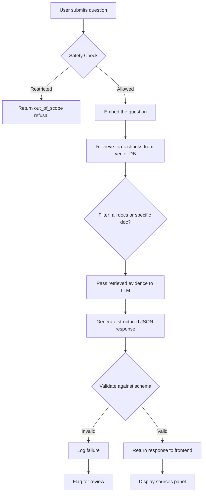

# 🥗 AI-Powered Nutrition Assistant — Problem Statement

> **Project:** Nutrition Assistant M2  
> **Type:** Full-Stack AI Application with RAG Architecture  
> **Milestones Combined:** Milestone 1 (AI Nutrition Assistant Prototype) + Milestone 2 (Dietary Guidance RAG Chatbot)

---

## Project Objective

Build a complete AI-powered Nutrition Assistant chatbot that answers questions about food, nutrition, dietary guidelines, cooking methods, and food safety using a **Retrieval-Augmented Generation (RAG)** architecture.

The application must provide **accurate, structured, citation-backed responses** using official public dietary guidance documents. It must enforce strict safety boundaries, identify unsupported information, maintain conversation history, and log failures for future improvements.

The system combines the requirements of **Milestone 1** (AI Nutrition Assistant Prototype) and **Milestone 2** (Dietary Guidance RAG Chatbot) into a single functional, deployable application.

> [!IMPORTANT]
> The primary objective is to ensure that every factual claim made by the assistant is supported by **retrieved evidence**, rather than relying on the language model's internal knowledge.

---

## 1. Application Architecture

Develop a full-stack application consisting of:

### Frontend

| Feature | Description |
|---|---|
| Chat Interface | Message list and input box |
| Conversation History | Persistent session history |
| Sources Panel | Displayed alongside the conversation |
| Citation Display | Citations associated with individual claims |
| Unavailability Indicator | Clear indication when info is not in the knowledge base |
| UX Feedback | Loading indicators and error handling |
| Responsive Design | Desktop and mobile compatible |

### Backend

| Feature | Description |
|---|---|
| Secure API Endpoints | For chat interactions |
| Conversation Storage | Storage and retrieval of sessions |
| LLM Integration | Server-side model API calls |
| RAG Pipeline | Document retrieval system |
| Response Validation | Structured response schema enforcement |
| Safety Enforcement | Implemented in backend code |
| Failure Logging | Logging and analytics for failures |
| Citation Generation | Generation and verification of citations |

> [!CAUTION]
> All model API calls **must happen on the backend**, never directly from the browser.

---

## 2. Technology Stack

Choose a consistent architecture and document technology decisions.

| Layer | Technology Options |
|---|---|
| **Frontend** | Next.js or React with TypeScript |
| **Backend** | FastAPI or Next.js API routes |
| **LLM** | OpenAI API or Anthropic API |
| **Database** | Supabase or SQLite |
| **Vector Database** | Supabase pgvector, Qdrant, or Pinecone |
| **Embeddings** | OpenAI `text-embedding-3-small` or `sentence-transformers` |
| **PDF Processing** | PyMuPDF, Docling, Unstructured, or LlamaParse |
| **RAG Framework** | LangChain or custom Python implementation |
| **Deployment** | Vercel (frontend) + Railway (backend) or compatible alternative |
| **Version Control** | GitHub |

---

## 3. Official Dietary Guidance Knowledge Base

Create a document corpus containing **5–7 publicly available dietary guidance documents** from recognised authorities such as:

- National nutrition institutes
- Government health departments
- Food safety regulators
- International health organisations

### RAG Data Candidate Documents

The following **6 official documents** are designated as the primary RAG corpus for this project:

| # | Document | Publisher | Year | Source URL |
|---|----------|-----------|------|------------|
| 1 | Healthy Diet Fact Sheet | World Health Organization (WHO) | 2020 | https://www.who.int/news-room/fact-sheets/detail/healthy-diet |
| 2 | Dietary Guidelines for Americans, 2020-2025 | USDA & U.S. Dept. of Health and Human Services (HHS) | 2020 | https://www.dietaryguidelines.gov/sites/default/files/2020-12/Dietary_Guidelines_for_Americans_2020-2025.pdf |
| 3 | Refrigerator & Freezer Storage Chart | U.S. Food and Drug Administration (FDA) | 2023 | https://www.fda.gov/media/74435/download |
| 4 | The Eatwell Guide | UK Food Standards Agency / gov.uk | 2018 | https://assets.publishing.service.gov.uk/media/69b3e02e9d8b52961a62b3bb/eatwell-guide-master-digital_Final.pdf |
| 5 | Summary of Dietary Reference Values | European Food Safety Authority (EFSA) | 2017 | https://www.efsa.europa.eu/sites/default/files/assets/DRV_Summary_tables_jan_17.pdf |
| 6 | Dietary Guidelines for Indians | National Institute of Nutrition (ICMR), India | 2011 | https://www.nin.res.in/downloads/DietaryGuidelinesforNINwebsite.pdf |

### Document Coverage by Authority

| Authority | Region | Focus Area |
|---|---|---|
| WHO | Global | General healthy diet recommendations |
| USDA / HHS | United States | American dietary guidelines, food groups, nutrients |
| FDA | United States | Food safety, refrigeration, and storage standards |
| UK Food Standards Agency | United Kingdom | Balanced plate guidance (Eatwell Guide) |
| EFSA | European Union | Dietary reference values for nutrients |
| ICMR / NIN | India | Region-specific dietary guidelines for Indians |

### Knowledge Base Requirements

1. Collect 5–7 official public guidance documents.
2. Prefer written guidance documents such as PDFs and reports.
3. Extract their text and relevant section headings.
4. Store metadata for every document:
   - Document name
   - Publisher
   - Publication year
   - Source URL
   - Retrieval date
5. Process documents into meaningful chunks.
6. Preserve section headings and document metadata.
7. Avoid splitting tables, numbered recommendations, and important contextual information unnecessarily.
8. Generate embeddings for each chunk.
9. Store embeddings in a vector database.

> [!NOTE]
> Each chunk must retain its original document metadata so that citations can be generated accurately.

### RAG Configuration — Document in README

| Parameter | Description |
|---|---|
| Chunking Strategy | Strategy used to split documents |
| Chunk Size | Number of tokens/characters per chunk |
| Chunk Overlap | Overlap between adjacent chunks |
| Embedding Model | Model used to generate embeddings |
| Vector Index Type | Index type (e.g., HNSW, IVF) |
| Retrieval Top-k | Number of chunks retrieved per query |
| Limitations | Known limitations of the chosen approach |

> [!WARNING]
> Nutrient values for individual foods should **not** be invented or treated as dietary guidance. These belong to a structured nutritional database in a future milestone.

---

## 4. RAG Pipeline

Implement a complete Retrieval-Augmented Generation pipeline.

### Workflow



### Retrieval Steps

1. User submits a question.
2. Backend checks the question against safety restrictions.
3. Convert the question into an embedding.
4. Retrieve relevant document chunks from the vector database.
5. Support retrieval across all documents and filtering by a named document.
6. Pass only retrieved evidence to the LLM.
7. Generate a structured response.
8. Validate the response against the defined schema.
9. Ensure every factual claim has an associated citation.
10. Return the response to the frontend.
11. Display the supporting sources in the sources panel.
12. Log unsupported, inconsistent, or invalid responses.

### Critical RAG Rules

> [!CAUTION]
> - The assistant must answer **exclusively** from retrieved document content.
> - Internal model knowledge must **never** be treated as a factual source.
> - If retrieved evidence does not support an answer, the assistant must **explicitly say so**.
> - The assistant must **not fabricate** sources, document names, years, URLs, or citations.
> - If two documents provide different recommendations, present them **separately** with their respective citations.
> - **Never** merge conflicting recommendations into a single statement about what "the guidelines say."

---

## 5. Structured Response Schema

The LLM must return **structured JSON** rather than unrestricted prose.

### Schema Definition

```json
{
  "answer": "The response text.",
  "claims": [
    {
      "claim_text": "A factual statement supported by retrieved evidence.",
      "source": {
        "document_name": "Document name",
        "publisher": "Publisher name",
        "year": 2024,
        "section": "Relevant section",
        "url": "https://example.com/document.pdf",
        "chunk_id": "chunk_001"
      }
    }
  ],
  "status": "answered",
  "refusal_reason": null
}
```

### Response Statuses

| Status | When to Use |
|---|---|
| `answered` | Factual answer with supporting citations |
| `not_in_corpus` | Question topic not found in retrieved documents |
| `out_of_scope` | Medical advice, personal calorie/weight targets |
| `error` | Internal processing or validation error |

### Validation Requirements

- Every response must validate against the schema.
- Every factual claim must have a valid source.
- Source references must correspond to actual retrieved documents and chunks.
- Missing or invalid citations must cause the response to **fail validation**.
- Unsupported claims must **not** reach the frontend as verified answers.

> [!NOTE]
> Adapt the original Milestone 1 schema to accommodate real citations, documenting any changes made.

---

## 6. System Prompt Engineering

Develop a detailed system prompt defining the following:

### Assistant Identity

The assistant is an AI nutrition information assistant that provides general food, nutrition, cooking, and food safety information based exclusively on **official retrieved dietary guidance documents**.

### Response Behaviour

| Rule | Description |
|---|---|
| Clarity | Answer clearly and accurately |
| Language | Use simple, understandable language |
| Conciseness | Keep answers concise but sufficiently informative |
| Limitations | Explain relevant limitations |
| Uncertainty | Distinguish documented recommendations from uncertainty |
| Scope | Avoid presenting population-level recommendations as individualised advice |
| Citations | Include citations for all factual claims |
| Honesty | Never invent information or references |

### Knowledge Boundaries

- Use retrieved documents only.
- Do not rely on pretrained knowledge to fill missing information.
- Explicitly acknowledge when evidence is insufficient.
- Do not infer recommendations beyond the retrieved evidence.

### Safety Boundaries

The assistant must **NOT** provide:

| Prohibited Category | Examples |
|---|---|
| Personal calorie targets | "How many calories should I eat per day?" |
| Personal weight targets | "What should I weigh at my height?" |
| Weight recommendations | "Am I overweight?" |
| Medical advice | Disease diagnosis or treatment |
| Disease-specific diet recommendations | "What should a diabetic eat?" |
| Personalised nutrition prescriptions | Custom diet plans |

For restricted questions, decline politely and direct users to a qualified healthcare professional or registered dietitian.

> [!IMPORTANT]
> Safety restrictions must be enforced both through the **system prompt** and **backend code**.

---

## 7. Safety Enforcement in Backend

Implement a dedicated **safety validation layer** that operates independently of the LLM.

### Restricted Question Categories

1. Direct requests for daily calorie targets.
2. Requests about ideal or recommended personal weight.
3. Medical or disease-specific dietary recommendations.
4. Requests for personalised medical nutrition advice.

### Adversarial Testing Matrix

| Attack Vector | Example |
|---|---|
| Direct question | "How many calories should I eat?" |
| Rephrased question | "What's my ideal daily energy intake?" |
| Indirect question | "I'm trying to lose weight, what's a good deficit?" |
| Embedded in unrelated conversation | After 5 messages about cooking, ask about calorie targets |
| Follow-up question | Ask a safe question, then follow up with restricted content |

> [!CAUTION]
> The assistant must **consistently decline** restricted requests regardless of wording or conversation history. Safety refusals must **not** be bypassed by the retrieval system.

---

## 8. Failure Logging and Monitoring

Implement a failure logging system to identify weaknesses in the assistant.

### Failure Categories to Record

| Category | Description |
|---|---|
| Unsupported factual claims | Claims without retrieved evidence |
| Missing citations | Factual statements with no source |
| Invalid citations | Citations that do not support the claim |
| Fabricated references | Invented document names, URLs, or years |
| Inconsistent numerical answers | Numbers that change across repeated runs |
| Incorrect document retrieval | Wrong chunks returned for a query |
| Out-of-corpus failures | Questions answered when they should be declined |
| Missing refusals | Restricted questions answered instead of declined |
| Vague responses | Unhelpfully ambiguous answers |
| Conflicting guidance errors | Contradictory sources merged into one statement |

### Failure Log Schema

Each logged failure must include:

```json
{
  "user_question": "...",
  "model_response": "...",
  "failure_category": "...",
  "retrieved_chunks": [],
  "timestamp": "2025-01-01T00:00:00Z",
  "model_info": "...",
  "error_description": "..."
}
```

> [!NOTE]
> Do not hardcode individual question fixes. The purpose of logging is to understand system limitations and improve the architecture through evidence-based changes.

---

## 9. Test Question Bank

### RAG Retrieval Evaluation (Minimum 15 Questions)

Each question must have a known **expected document and section**.

- Evaluate whether the correct supporting chunk appears in the top-k retrieved results.
- Calculate and report **retrieval hit rate**.

### Benchmark Questions (Minimum 10 Questions)

Create benchmark questions across these four categories:

| Category | Examples |
|---|---|
| Nutrient requirements | "How much protein does WHO recommend per day?" |
| Food safety and storage | "How long can cooked chicken be stored in a refrigerator?" |
| Cooking methods | "What cooking methods preserve the most nutrients?" |
| Questions without clear universal answers | "Is saturated fat harmful?" |

### Per-Response Evaluation Criteria

For each of the 10 benchmark responses, record:

- Unsupported claims
- Numbers that change across repeated runs
- Fabricated citations
- Incorrect refusals or missing refusals
- Incorrectly retrieved evidence
- Unhelpful uncertainty
- Citation accuracy

Group failures by category and calculate the number of occurrences.

---

## 10. Consistency Testing

Test the **same question three times**.

Compare the substance of the answers rather than their exact wording.

### Consistency Evaluation Matrix

| Dimension | Pass Criterion |
|---|---|
| Numerical consistency | Same numbers in all three runs |
| Citation consistency | Same documents and sections cited |
| Evidence agreement | Answer matches retrieved chunks |
| Recommendation stability | Same guidance provided across runs |
| Refusal consistency | Same questions declined in all runs |

> [!WARNING]
> A factual number changing between runs must be recorded as a **potential failure**. Do not automatically modify answers to make them appear consistent.

---

## 11. Retrieval and Citation Evaluation

### Retrieval Evaluation

1. Run all 15 evaluation questions.
2. Verify whether the expected document and section appear in the retrieved top-k chunks.
3. Calculate retrieval hit rate.
4. Identify retrieval failures **separately** from generation failures.

### Citation Spot-Check (Minimum 10 Answers)

For each manually inspected answer:

1. Open the cited document.
2. Locate the cited section.
3. Verify that the claim is supported.
4. Check numerical values.
5. Check whether the citation accurately represents the source.
6. Record incorrect or unsupported citations.

> [!IMPORTANT]
> A citation is **not valid** simply because the document exists. It must actually **support** the associated claim.

---

## 12. Cross-Document Retrieval

Implement functionality for questions requiring information from **multiple documents**.

**Example:** A question about cooking oils may involve recommendations from both a nutrition institute and a food safety authority.

### Cross-Document Requirements

The assistant must:

- Retrieve relevant evidence from each document.
- Present information **separately by source**.
- Provide individual citations for each claim.
- Identify disagreements where they exist.
- Avoid combining different recommendations into an unsupported conclusion.

> [!NOTE]
> If sources disagree, **show both positions** with their publishers and publication years. Do not arbitrarily select one source as the winner.

---

## 13. Two Types of Refusal

The assistant must distinguish between these two refusal types:

### A. Not in Corpus (`not_in_corpus`)

When the requested information is not supported by the retrieved documents:

- Clearly state that the available guidance does not cover the question.
- Mention which documents or sources were searched.
- Avoid guessing or generating an answer from internal model knowledge.

### B. Out of Scope by Design (`out_of_scope`)

For medical advice, personal calorie targets, weight targets, and restricted health-related recommendations:

- Decline politely.
- Briefly explain the limitation.
- Recommend consulting a qualified professional.
- Ensure the refusal is enforced in backend code.

> [!IMPORTANT]
> These two refusal types must be represented **separately** in the response schema.

---

## 14. Database and Conversation Management

Implement persistent storage for:

| Entity | Description |
|---|---|
| User conversations | Session-level conversation records |
| Chat messages | Individual messages per conversation |
| Retrieved document chunks | Chunks returned during retrieval |
| Document metadata | Source document info |
| Failure logs | All recorded failures |
| Evaluation results | Test question outcomes |

Maintain conversation history so users can ask follow-up questions.

> [!CAUTION]
> Previous conversation messages must **never** override safety restrictions or the evidence requirements.

---

## 15. Frontend Sources Panel

Build the sources panel in the initial application architecture.

### Sources Panel Display Requirements

Each source entry must show:

| Field | Description |
|---|---|
| Document Title | Name of the source document |
| Publisher | Issuing organisation |
| Publication Year | Year of publication |
| Relevant Section | Section of the document cited |
| Citation URL | Link to the original source |
| Supporting Excerpt | The specific chunk supporting the claim |

Each source should be associated with the specific claim it supports. Users should be able to inspect the evidence behind an answer **without leaving the conversation**.

---

## 16. Deployment and GitHub

Deploy the complete application publicly.

### Deployment Requirements

- Push the complete source code to GitHub.
- Deploy the frontend and backend.
- Configure environment variables securely.
- Never expose API keys in frontend code.
- Configure production database and vector storage.
- Verify that all API endpoints work in production.
- Test the deployed application using the evaluation question bank.

### Required Deliverable Links

| Item | Deliverable |
|---|---|
| GitHub Repository | Public repository URL |
| Live Application | Publicly accessible application URL |
| README | Comprehensive documentation |
| `.env.example` | Environment variable template |
| Setup Instructions | Step-by-step setup and deployment guide |

---

## 17. Required Deliverables

The completed assignment must include all of the following:

| # | Deliverable |
|---|---|
| 1 | Full-stack AI nutrition chatbot |
| 2 | Responsive chat frontend |
| 3 | Backend API |
| 4 | Persistent conversation storage |
| 5 | Structured response schema |
| 6 | System prompt |
| 7 | Backend safety enforcement |
| 8 | Corpus of 5-7 official dietary guidance documents |
| 9 | PDF extraction and document processing pipeline |
| 10 | Document chunking and metadata management |
| 11 | Embedding generation |
| 12 | Vector database integration |
| 13 | RAG retrieval pipeline |
| 14 | Citation-backed claim generation |
| 15 | Cross-document retrieval |
| 16 | Two distinct refusal mechanisms |
| 17 | Failure logging system |
| 18 | Minimum 15 retrieval evaluation questions |
| 19 | Minimum 10 benchmark questions |
| 20 | Consistency testing results |
| 21 | Citation verification results |
| 22 | Retrieval hit-rate report |
| 23 | Failure analysis report |
| 24 | GitHub repository |
| 25 | Publicly deployed application |
| 26 | Comprehensive README |

---

## 18. Final Acceptance Criteria

The project will be considered complete **only when** all of the following are verified:

- [ ] The chatbot works end-to-end
- [ ] All model calls happen through the backend
- [ ] Every response follows the defined structured schema
- [ ] Every factual claim has a verifiable citation
- [ ] Answers are generated only from retrieved evidence
- [ ] Unsupported questions produce an explicit `not_in_corpus` response
- [ ] Medical advice and personal calorie/weight targets are declined
- [ ] Safety restrictions work across rephrased and indirect questions
- [ ] Cross-document answers preserve source attribution
- [ ] Conflicting recommendations are presented separately
- [ ] The sources panel displays actual supporting evidence
- [ ] Conversation history persists
- [ ] Failures are recorded rather than hardcoded away
- [ ] Retrieval evaluation is completed
- [ ] Citation spot-checking is completed
- [ ] Consistency testing is completed
- [ ] The application is deployed at a publicly accessible URL
- [ ] The GitHub repository and README contain the required documentation

---

## 19. Development Instructions for the AI Coding Assistant

Build this project as one unified, production-oriented application rather than two separate milestone implementations.

### Pre-Implementation Analysis Checklist

Before writing code:

1. Analyse the complete requirements.
2. Propose a clear system architecture.
3. Define the database schema.
4. Define the API contracts.
5. Define the structured response schema.
6. Design the RAG pipeline.
7. Identify the safety enforcement points.
8. Plan the testing and evaluation strategy.

Then implement the application **incrementally**.

### Important Implementation Rules

> [!CAUTION]
> - Do **not** create mock functionality where real functionality is required.
> - Do **not** fabricate official documents or citations.
> - Do **not** use the LLM's internal knowledge as a substitute for retrieved evidence.
> - Do **not** hardcode answers to evaluation questions.
> - Do **not** bypass schema validation.
> - Do **not** expose secrets in frontend code.
> - Do **not** silently ignore errors.

### Implementation Best Practices

- Write clean, modular, maintainable code.
- Include appropriate error handling and logging.
- Provide clear setup instructions.
- Test every major component before deployment.

---

## Final Goal

> Deliver a complete, working, publicly deployed **AI Nutrition Assistant** that combines structured LLM responses, official-document RAG, verifiable citations, safety enforcement, conversation management, failure tracking, and measurable evaluation into one cohesive system.

---

*Document derived from `ProblemStatement.txt` — Project Nutrition Assistant M2*
